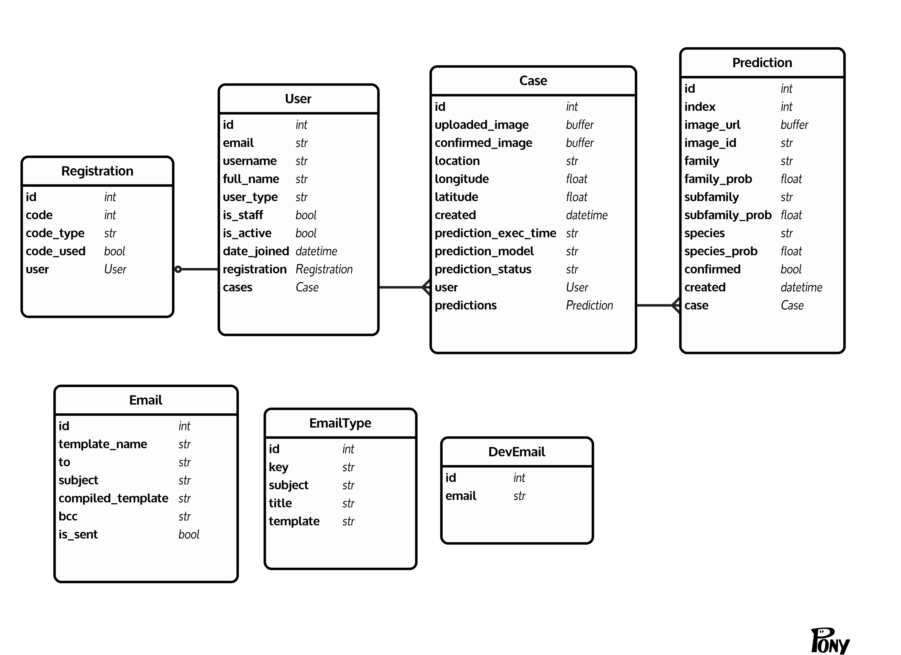

# REST API for Lepi App
The REST API is built with Django REST Framework. 

It is used for user management as well as storing data about prediction cases. This data could be used to retrieve all previous
cases, analysis etc. 

The data is stored in a Postgres database.

> In following explanation, https://api.lepi.propulsion-home.ch is used as domain name. If you deploy your app to another domain, you will of course have to update this address.
> Each url is also accessible with http://yourLocalDomain:PORT, if you run a local development server

- [Endpoints](#endpoints)
- [Admin](#admin)
- [Users](#users)
- [Cases and Predictions](#cases-and-predictions)
- [Emails](#emails)
- [Email Models](#email-models)
- [Models](#models)
- [Run the project locally](#run-the-project-locally)

## Endpoints

Detailed documentation about the API endpoints can be found at https://api.lepi.propulsion-home.ch/backend/api/docs/

For convenience, you can import the Lepi.postman_collection.json into postman and test the endpoints there. https://www.postman.com/
The collection can be found in /backend

## Admin

With a staff or superuser account, you are able to login to https://api.lepi.propulsion-home.ch/backend/lepi-admin/ to
manage users and cases.

The site .../admin/ is the default location for the admin site in Django. For security measures, we have renamed it as 
mentioned above. All login requests to /admin/ will land in a honeypot and be visible in /lepi-admin/.

## Users

Users can be created via the admin panel or via App. Creating a user via admin is a 2-step process. After having set the email, username and password, another form opens. 
Make sure to also fill the required information there. Otherwise, the related registration profile will be missing and the user won't be able to reset his password.

As logged in user, you can invite other users. They will receive an email with a registration code and they can sign up with it.

There is currently no way to register without knowing an admin or getting invited by an existing user.

## Cases and Predictions

Cases hold the information about which user uploaded an image, if and which image he confirmed as well as information about
the model, other prediction choices etc.

This data is currently not being used.

## Emails

Emails are automatically sent when a user is invited or a reset password code has been requested. This is handled in the 
background / asynchronously with redis and celery.

### Email Models

- Email: Is the effective html code being sent by email. We use Django templates with html, to be able to style the content as we want.
- EmailType: Defines the dynamic content based on what email type it is and the html extension. For example registration or password reset.
- DevEmail: Email addresses need to be registered as dev emails if you want to receive emails in development mode.

## Models

## Run the project locally

- You will need to have Docker installed on your machine. https://docs.docker.com/get-docker/

- After having cloned the repo, through the terminal, navigate inside the folder where the Dockerfile is located
- Run `docker build -t lepi .` to create the Docker image on your machine. You can replace 'lepi' with any name you want
- Replace the image name of the backend container in 'docker-compose.yml', with the name you used to build the image in previous step

- Run `docker-compose up -d` in your terminal, to start up all containers. This will also pull the needed Docker images such as Postgres, Redis etc. if you don't already have them on your machine.
- Run `docker exec -ti lepi_backend_1 bash` in your terminal. This is to log into the container, which is running the REST API. Make sure 'lepi_backend_1' is the name of the running container. Else replace it with the correct name or with the container ID.
- Run `python manage.py runserver 0:8000` and visit http://0.0.0.0:8000/ - you should get a 404 served by Django, means it is running! We just do not serve anything on `/`.
- Run `python manage.py migrate` to create the tables in your database (this needs only to be done the first time or if you update the models)
- Run `python manage.py createsuperuser` to create a superuser. Visit http://0.0.0.0:8000/backend/lepi-admin and use the credentials to log in

## Environment variables in development mode

- To have emails being sent automatically for registration and password resetting, you will have to add a gmail address and password in /envs/dev.env
- For emails to be sent out during development mode, you will also have to add your email through Django admin under DevEmails

- If you would like to add Sentry, which can help monitoring and debugging, you will also have to add your Sentry DSN
